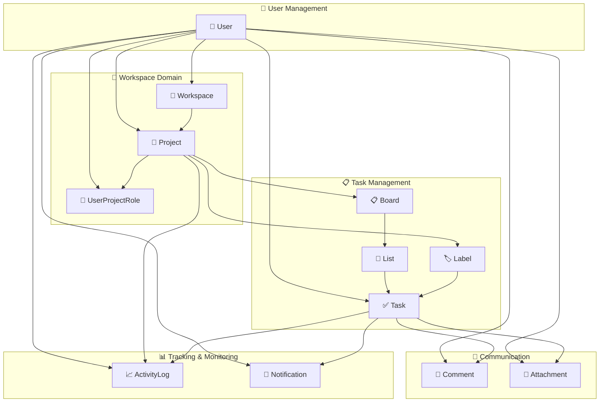
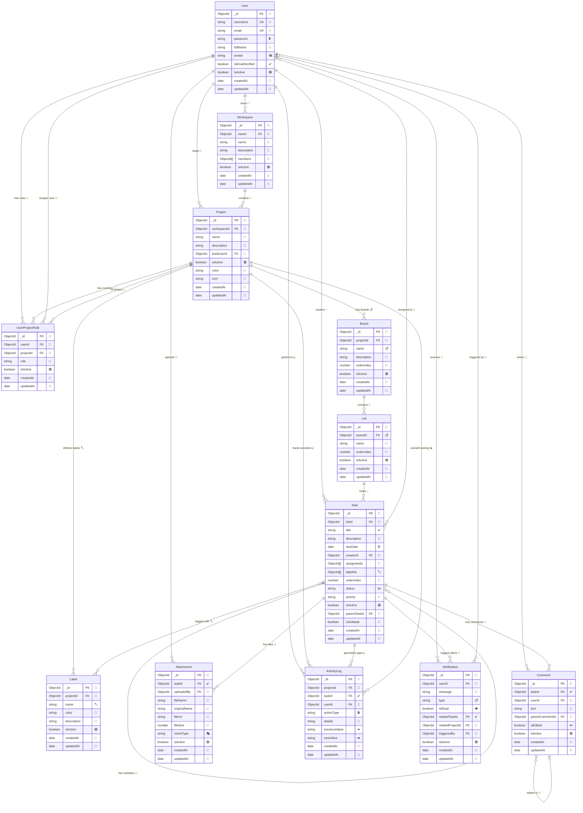

# Task Manager 프로젝트 ERD (Entity Relationship Diagram)

## 📋 프로젝트 개요

개인/팀 작업 관리 시스템을 위한 MongoDB 기반 데이터베이스 설계입니다.
NestJS + Mongoose를 사용하여 구현되었으며, 이벤트 기반 아키텍처를 적용한 알림 시스템을 포함합니다.

### 🏗️ **주요 기능 모듈**

- **Core Modules**: 사용자, 워크스페이스, 프로젝트, 작업 관리
- **Notification System**: 이벤트 기반 실시간 알림 (인앱, 이메일, WebSocket)
- **Search System**: 전역 검색 (작업, 프로젝트, 사용자, 댓글)
- **File Management**: 첨부파일 업로드 및 관리
- **Activity Tracking**: 사용자 활동 로그 및 감사

---

## 📊 엔티티 관계도 (도메인별 그룹화)

### 🏗️ **전체 시스템 아키텍처**



### 📝 **상세 엔티티 관계도**



### 🎯 **도메인별 상세 설명**

#### 👤 **User Management (사용자 관리)**

- **User**: 시스템의 모든 사용자 정보를 관리하는 핵심 엔티티
- 사용자 인증, 프로필 관리, 이메일 인증 상태 등을 추적
- 시스템 내 모든 활동의 주체가 되는 중앙집중형 설계

#### 🏢 **Workspace Domain (워크스페이스 영역)**

- **Workspace**: 최상위 조직 단위로 여러 프로젝트를 포함
- **Project**: 실제 작업이 이루어지는 프로젝트 단위
- **UserProjectRole**: 사용자의 프로젝트별 권한과 역할을 세밀하게 관리
- 계층적 구조로 대규모 조직의 복잡한 권한 체계 지원

#### 📋 **Task Management (작업 관리)**

- **Board → List → Task**: 칸반 보드의 3단계 계층 구조
- **Label**: 작업 분류와 필터링을 위한 태그 시스템
- **Task**: 하위 작업(subtask) 지원으로 복잡한 작업 분해 가능
- 유연한 작업 조직화와 우선순위 관리 체계

#### 💬 **Communication (커뮤니케이션)**

- **Comment**: 실시간 협업을 위한 댓글 시스템 (중첩 댓글 지원)
- **Attachment**: 파일 첨부 및 문서 공유 기능
- 작업 중심의 상황별 커뮤니케이션 지원

#### 📊 **Tracking & Monitoring (추적 및 모니터링)**

- **ActivityLog**: 모든 시스템 활동에 대한 감사 추적
- **Notification**: 이벤트 기반 실시간 알림 시스템
- 완전한 투명성과 실시간 상황 인식 제공

### 🔄 **도메인 간 주요 상호작용**

1. **사용자 중심 설계**: User가 모든 도메인의 중심축 역할
2. **계층적 권한**: Workspace → Project → Task 순으로 권한 상속
3. **이벤트 기반 알림**: 모든 도메인의 변경사항이 Notification으로 전파
4. **완전한 추적성**: ActivityLog가 모든 도메인의 변경사항 기록
5. **실시간 통신**: WebSocket을 통한 즉시 알림 전송
6. **다중 채널 알림**: 인앱 + 이메일 + WebSocket 통합 처리

---

## 🗃️ 엔티티 상세 설명

### 1. **User** (사용자)

사용자 계정 정보를 관리하는 핵심 엔티티

| 필드명            | 타입     | 설명              | 제약조건         |
| ----------------- | -------- | ----------------- | ---------------- |
| `_id`             | ObjectId | 기본키            | Primary Key      |
| `username`        | String   | 사용자명          | Required, Unique |
| `email`           | String   | 이메일            | Required, Unique |
| `password`        | String   | 해싱된 비밀번호   | Required         |
| `fullName`        | String   | 실명              | Optional         |
| `avatar`          | String   | 프로필 이미지 URL | Optional         |
| `isEmailVerified` | Boolean  | 이메일 인증 여부  | Default: false   |
| `isActive`        | Boolean  | 활성 상태         | Default: true    |
| `createdAt`       | Date     | 생성일시          | Auto             |
| `updatedAt`       | Date     | 수정일시          | Auto             |

**관계:**

- Workspace (1:N) - 소유하는 워크스페이스들
- Project (1:N) - 리드하는 프로젝트들
- Task (1:N) - 생성한 작업들
- UserProjectRole (1:N) - 프로젝트 내 역할들
- Comment (1:N) - 작성한 댓글들
- Attachment (1:N) - 업로드한 첨부파일들
- ActivityLog (1:N) - 수행한 활동들
- Notification (1:N) - 받은 알림들

---

### 2. **Workspace** (워크스페이스)

프로젝트들을 그룹화하는 최상위 컨테이너

| 필드명        | 타입       | 설명              | 제약조건            |
| ------------- | ---------- | ----------------- | ------------------- |
| `_id`         | ObjectId   | 기본키            | Primary Key         |
| `owner`       | ObjectId   | 소유자 ID         | Required, Ref: User |
| `name`        | String     | 워크스페이스 이름 | Required            |
| `description` | String     | 설명              | Optional            |
| `members`     | ObjectId[] | 멤버 ID 배열      | Ref: User           |
| `isActive`    | Boolean    | 활성 상태         | Default: true       |
| `createdAt`   | Date       | 생성일시          | Auto                |
| `updatedAt`   | Date       | 수정일시          | Auto                |

**관계:**

- User (N:1) - 소유자
- Project (1:N) - 포함하는 프로젝트들

---

### 3. **Project** (프로젝트)

작업들을 조직화하는 단위

| 필드명        | 타입     | 설명             | 제약조건                 |
| ------------- | -------- | ---------------- | ------------------------ |
| `_id`         | ObjectId | 기본키           | Primary Key              |
| `workspaceId` | ObjectId | 워크스페이스 ID  | Required, Ref: Workspace |
| `name`        | String   | 프로젝트 이름    | Required                 |
| `description` | String   | 설명             | Optional                 |
| `leadUserId`  | ObjectId | 프로젝트 리더 ID | Required, Ref: User      |
| `isActive`    | Boolean  | 활성 상태        | Default: true            |
| `color`       | String   | 프로젝트 색상    | Optional                 |
| `icon`        | String   | 프로젝트 아이콘  | Optional                 |
| `createdAt`   | Date     | 생성일시         | Auto                     |
| `updatedAt`   | Date     | 수정일시         | Auto                     |

**관계:**

- Workspace (N:1) - 소속 워크스페이스
- User (N:1) - 프로젝트 리더
- Board (1:N) - 포함하는 보드들
- Label (1:N) - 프로젝트 레이블들
- ActivityLog (1:N) - 활동 로그들
- UserProjectRole (1:N) - 사용자 역할들

---

### 4. **Board** (보드)

칸반 스타일의 보드

| 필드명        | 타입     | 설명        | 제약조건               |
| ------------- | -------- | ----------- | ---------------------- |
| `_id`         | ObjectId | 기본키      | Primary Key            |
| `projectId`   | ObjectId | 프로젝트 ID | Required, Ref: Project |
| `name`        | String   | 보드 이름   | Required               |
| `description` | String   | 설명        | Optional               |
| `orderIndex`  | Number   | 정렬 순서   | Default: 0             |
| `isActive`    | Boolean  | 활성 상태   | Default: true          |
| `createdAt`   | Date     | 생성일시    | Auto                   |
| `updatedAt`   | Date     | 수정일시    | Auto                   |

**관계:**

- Project (N:1) - 소속 프로젝트
- List (1:N) - 포함하는 리스트들

---

### 5. **List** (리스트/컬럼)

보드 내의 작업 컬럼

| 필드명       | 타입     | 설명        | 제약조건             |
| ------------ | -------- | ----------- | -------------------- |
| `_id`        | ObjectId | 기본키      | Primary Key          |
| `boardId`    | ObjectId | 보드 ID     | Required, Ref: Board |
| `name`       | String   | 리스트 이름 | Required             |
| `orderIndex` | Number   | 정렬 순서   | Default: 0           |
| `isActive`   | Boolean  | 활성 상태   | Default: true        |
| `createdAt`  | Date     | 생성일시    | Auto                 |
| `updatedAt`  | Date     | 수정일시    | Auto                 |

**관계:**

- Board (N:1) - 소속 보드
- Task (1:N) - 포함하는 작업들

---

### 6. **Task** (작업/카드)

실제 작업 항목

| 필드명        | 타입       | 설명           | 제약조건                                  |
| ------------- | ---------- | -------------- | ----------------------------------------- |
| `_id`         | ObjectId   | 기본키         | Primary Key                               |
| `listId`      | ObjectId   | 리스트 ID      | Required, Ref: List                       |
| `title`       | String     | 작업 제목      | Required                                  |
| `description` | String     | 작업 설명      | Optional                                  |
| `dueDate`     | Date       | 마감일         | Optional                                  |
| `creatorId`   | ObjectId   | 생성자 ID      | Required, Ref: User                       |
| `assigneeIds` | ObjectId[] | 담당자 ID 배열 | Ref: User                                 |
| `labelIds`    | ObjectId[] | 레이블 ID 배열 | Ref: Label                                |
| `orderIndex`  | Number     | 정렬 순서      | Default: 0                                |
| `status`      | String     | 상태           | Enum: ['todo', 'in-progress', 'done']     |
| `priority`    | String     | 우선순위       | Enum: ['low', 'medium', 'high', 'urgent'] |
| `isActive`    | Boolean    | 활성 상태      | Default: true                             |
| `createdAt`   | Date       | 생성일시       | Auto                                      |
| `updatedAt`   | Date       | 수정일시       | Auto                                      |

**관계:**

- List (N:1) - 소속 리스트
- User (N:1) - 작업 생성자
- User (N:M) - 작업 담당자들
- Label (N:M) - 연결된 레이블들
- Comment (1:N) - 작업 댓글들
- Attachment (1:N) - 첨부파일들
- ActivityLog (1:N) - 활동 로그들
- Notification (1:N) - 관련 알림들

---

### 7. **Label** (레이블)

작업 분류를 위한 태그

| 필드명        | 타입     | 설명        | 제약조건               |
| ------------- | -------- | ----------- | ---------------------- |
| `_id`         | ObjectId | 기본키      | Primary Key            |
| `projectId`   | ObjectId | 프로젝트 ID | Required, Ref: Project |
| `name`        | String   | 레이블 이름 | Required               |
| `color`       | String   | 레이블 색상 | Required               |
| `description` | String   | 설명        | Optional               |
| `isActive`    | Boolean  | 활성 상태   | Default: true          |
| `createdAt`   | Date     | 생성일시    | Auto                   |
| `updatedAt`   | Date     | 수정일시    | Auto                   |

**관계:**

- Project (N:1) - 소속 프로젝트
- Task (N:M) - 연결된 작업들

---

### 8. **Comment** (댓글)

작업에 대한 댓글

| 필드명            | 타입     | 설명         | 제약조건               |
| ----------------- | -------- | ------------ | ---------------------- |
| `_id`             | ObjectId | 기본키       | Primary Key            |
| `taskId`          | ObjectId | 작업 ID      | Required, Ref: Task    |
| `userId`          | ObjectId | 작성자 ID    | Required, Ref: User    |
| `text`            | String   | 댓글 내용    | Required               |
| `parentCommentId` | ObjectId | 부모 댓글 ID | Optional, Ref: Comment |
| `isEdited`        | Boolean  | 수정 여부    | Default: false         |
| `isActive`        | Boolean  | 활성 상태    | Default: true          |
| `createdAt`       | Date     | 생성일시     | Auto                   |
| `updatedAt`       | Date     | 수정일시     | Auto                   |

**관계:**

- Task (N:1) - 소속 작업
- User (N:1) - 댓글 작성자
- Comment (N:1) - 부모 댓글 (대댓글용)

---

### 9. **Attachment** (첨부파일)

작업에 첨부된 파일

| 필드명         | 타입     | 설명              | 제약조건            |
| -------------- | -------- | ----------------- | ------------------- |
| `_id`          | ObjectId | 기본키            | Primary Key         |
| `taskId`       | ObjectId | 작업 ID           | Required, Ref: Task |
| `uploadedBy`   | ObjectId | 업로더 ID         | Required, Ref: User |
| `fileName`     | String   | 저장된 파일명     | Required            |
| `originalName` | String   | 원본 파일명       | Required            |
| `fileUrl`      | String   | 파일 URL          | Required            |
| `fileSize`     | Number   | 파일 크기 (bytes) | Required            |
| `mimeType`     | String   | MIME 타입         | Required            |
| `isActive`     | Boolean  | 활성 상태         | Default: true       |
| `createdAt`    | Date     | 생성일시          | Auto                |
| `updatedAt`    | Date     | 수정일시          | Auto                |

**관계:**

- Task (N:1) - 소속 작업
- User (N:1) - 파일 업로더

---

### 10. **ActivityLog** (활동 로그)

프로젝트/작업 관련 활동 기록

| 필드명          | 타입     | 설명           | 제약조건               |
| --------------- | -------- | -------------- | ---------------------- |
| `_id`           | ObjectId | 기본키         | Primary Key            |
| `projectId`     | ObjectId | 프로젝트 ID    | Required, Ref: Project |
| `taskId`        | ObjectId | 작업 ID        | Optional, Ref: Task    |
| `userId`        | ObjectId | 사용자 ID      | Required, Ref: User    |
| `actionType`    | String   | 활동 타입      | Required, Enum         |
| `details`       | String   | 활동 상세 내용 | Required               |
| `previousValue` | String   | 이전 값        | Optional               |
| `newValue`      | String   | 새 값          | Optional               |
| `createdAt`     | Date     | 생성일시       | Auto                   |
| `updatedAt`     | Date     | 수정일시       | Auto                   |

**ActionType Enum:**

- `task_created`, `task_updated`, `task_completed`, `task_assigned`, `task_moved`
- `comment_added`, `attachment_added`, `project_updated`

**관계:**

- Project (N:1) - 관련 프로젝트
- Task (N:1) - 관련 작업 (선택적)
- User (N:1) - 활동 수행자

---

### 11. **Notification** (알림)

사용자에게 전송되는 알림

| 필드명             | 타입     | 설명               | 제약조건               |
| ------------------ | -------- | ------------------ | ---------------------- |
| `_id`              | ObjectId | 기본키             | Primary Key            |
| `userId`           | ObjectId | 수신자 ID          | Required, Ref: User    |
| `message`          | String   | 알림 메시지        | Required               |
| `type`             | String   | 알림 타입          | Required, Enum         |
| `isRead`           | Boolean  | 읽음 여부          | Default: false         |
| `relatedTaskId`    | ObjectId | 관련 작업 ID       | Optional, Ref: Task    |
| `relatedProjectId` | ObjectId | 관련 프로젝트 ID   | Optional, Ref: Project |
| `triggeredBy`      | ObjectId | 트리거한 사용자 ID | Optional, Ref: User    |
| `isActive`         | Boolean  | 활성 상태          | Default: true          |
| `createdAt`        | Date     | 생성일시           | Auto                   |
| `updatedAt`        | Date     | 수정일시           | Auto                   |

**Type Enum:**

- `task_assigned`, `task_due`, `comment_added`, `project_invite`, `task_completed`

**알림 처리 방식 (이벤트 기반):**

- **이벤트 발행**: 다른 서비스에서 `NotificationEventHelper`를 통해 이벤트 발행
- **이벤트 리스너**: `NotificationsService`에서 `@OnEvent` 데코레이터로 이벤트 수신
- **다중 채널 알림**:
  - 📱 **인앱 알림**: MongoDB에 저장
  - 📧 **이메일 알림**: SMTP를 통한 이메일 발송
  - ⚡ **실시간 알림**: WebSocket을 통한 즉시 푸시
- **비동기 처리**: 순환 의존성 없는 완전 비동기 처리

**관계:**

- User (N:1) - 알림 수신자
- Task (N:1) - 관련 작업 (선택적)
- Project (N:1) - 관련 프로젝트 (선택적)
- User (N:1) - 알림 트리거 사용자 (선택적)

---

### 12. **UserProjectRole** (사용자 프로젝트 역할)

프로젝트 내 사용자의 역할 정의

| 필드명      | 타입     | 설명        | 제약조건                                      |
| ----------- | -------- | ----------- | --------------------------------------------- |
| `_id`       | ObjectId | 기본키      | Primary Key                                   |
| `userId`    | ObjectId | 사용자 ID   | Required, Ref: User                           |
| `projectId` | ObjectId | 프로젝트 ID | Required, Ref: Project                        |
| `role`      | String   | 역할        | Required, Enum: ['admin', 'member', 'viewer'] |
| `isActive`  | Boolean  | 활성 상태   | Default: true                                 |
| `createdAt` | Date     | 생성일시    | Auto                                          |
| `updatedAt` | Date     | 수정일시    | Auto                                          |

**Unique Index:** `{ userId: 1, projectId: 1 }`

**관계:**

- User (N:1) - 사용자
- Project (N:1) - 프로젝트

---

## 🔗 주요 관계 특징

### **다대다 관계 (Many-to-Many)**

1. **Task ↔ User (Assignees)** - `assigneeIds` 배열로 구현
2. **Task ↔ Label** - `labelIds` 배열로 구현

### **계층 구조 (Hierarchical)**

1. **Workspace → Project → Board → List → Task**
2. **Comment → Comment** (대댓글 관계)

### **추적 관계 (Tracking)**

1. **ActivityLog** - 모든 중요한 활동 추적
2. **Notification** - 사용자에게 실시간 알림

### **권한 관리 (Access Control)**

1. **UserProjectRole** - 프로젝트별 세분화된 권한
2. **Workspace.members** - 워크스페이스 멤버십

### **이벤트 기반 시스템 (Event-Driven)**

1. **Notification Events** - 순환 의존성 없는 알림 처리
2. **Real-time Updates** - WebSocket을 통한 실시간 통신
3. **Email Integration** - SMTP를 통한 이메일 알림

### **검색 시스템 (Search System)**

1. **Global Search** - 모든 엔티티에 대한 통합 검색
2. **Type-specific Search** - 엔티티별 세분화된 검색
3. **Full-text Search** - MongoDB 텍스트 검색 활용

---

## 🎯 인덱스 전략

### **성능 최적화 인덱스**

```javascript
// 자주 조회되는 필드들
User: { username: 1, email: 1 }
Task: { listId: 1, assigneeIds: 1, status: 1 }
Comment: { taskId: 1, createdAt: -1 }
ActivityLog: { projectId: 1, createdAt: -1 }
Notification: { userId: 1, isRead: 1, createdAt: -1 }

// 복합 인덱스
UserProjectRole: { userId: 1, projectId: 1 } // Unique
Task: { listId: 1, orderIndex: 1 }

// 검색 최적화 인덱스
Task: { title: "text", description: "text" }
Project: { name: "text", description: "text" }
User: { username: "text", fullName: "text" }
Comment: { text: "text" }
```

### **데이터 무결성**

- 모든 참조 필드에 적절한 `ref` 설정
- 소프트 삭제를 위한 `isActive` 필드
- 자동 타임스탬프 (`createdAt`, `updatedAt`)

---

## 📊 확장 가능성

### **현재 구현된 추가 기능**

1. **✅ Email System** - SMTP 기반 이메일 알림
2. **✅ Search System** - 전역 통합 검색 기능
3. **✅ Event-Driven Architecture** - 순환 의존성 없는 이벤트 기반 알림
4. **✅ Real-time Notifications** - WebSocket 기반 실시간 알림
5. **✅ File Upload** - 첨부파일 업로드 및 관리

### **향후 추가 가능한 엔티티**

1. **Team** - 팀 관리 및 팀별 권한
2. **Template** - 프로젝트/작업 템플릿
3. **Integration** - 외부 서비스 연동 (Slack, Discord, etc.)
4. **Webhook** - 이벤트 훅 및 외부 API 연동
5. **Dashboard** - 개인화된 대시보드 설정
6. **Report** - 리포트 생성 및 분석
7. **Automation** - 자동화 규칙 및 트리거
8. **Calendar Integration** - 외부 캘린더 연동 (Google, Outlook)

### **아키텍처 특장점**

- **📈 확장성**: 이벤트 기반 구조로 새로운 기능 추가 용이
- **🔄 유연성**: 마이크로서비스 전환 가능한 구조
- **⚡ 성능**: MongoDB 인덱스 최적화 및 비동기 처리
- **🛡️ 안정성**: 소프트 삭제 및 데이터 무결성 보장

이 ERD는 확장 가능하고 유연한 구조로 설계되어 추후 기능 추가에 대응할 수 있습니다.
